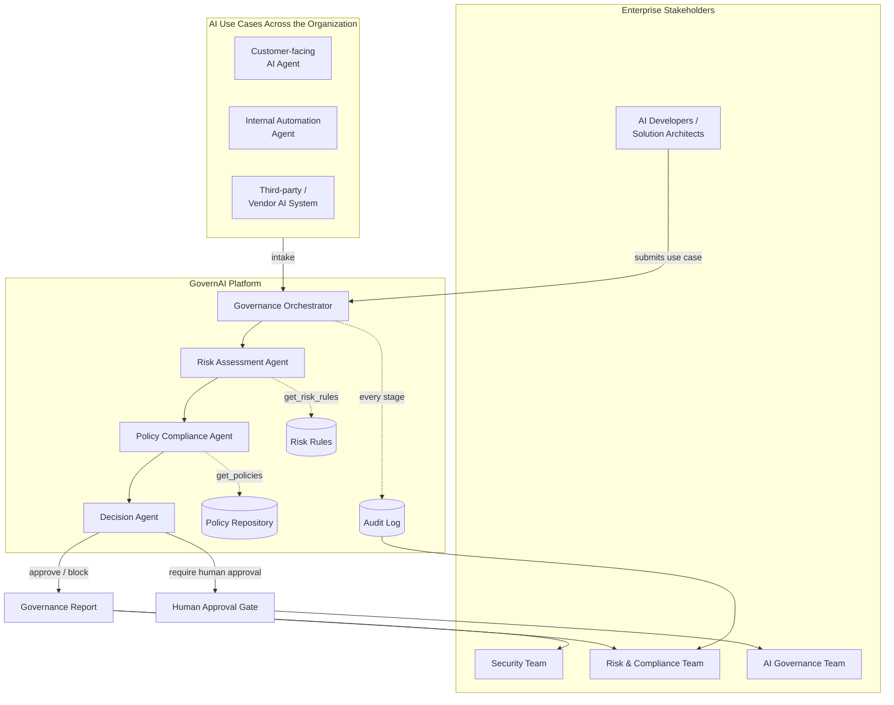

# GovernAI

A Multi-Agent AI Governance Platform. Organizations adopting AI systems and
AI agents often lack a centralized, automated way to assess risk, check
policy compliance, and govern AI use cases — leading to security, privacy,
compliance, and operational exposure. GovernAI gives AI governance, risk,
compliance, and security teams (and the developers building AI systems) a
repeatable pipeline for reviewing an AI use case before and after it ships.

Three agents, each backed by an LLM via the [OpenAI API](https://platform.openai.com),
collaborate on every submission:

- **Risk Assessment Agent** — evaluates the use case and assigns a risk
  level (`low` / `medium` / `high` / `critical`) with a numeric score and
  named risk factors.
- **Policy Compliance Agent** — checks the use case against the
  organizational policy repository and reports satisfied/violated policies.
- **Decision Agent** — combines both findings and recommends `approve`,
  `require_human_approval`, or `block`.

The platform is built so additional specialized agents (e.g. a Bias/Fairness
Agent, a Vendor Risk Agent) can be added later without changing the
orchestration model.

## Enterprise Architecture

How GovernAI sits between the people who own AI risk and the AI use cases
running across the organization:



At enterprise scale, every AI use case — whether built in-house, deployed
internally, or brought in from a vendor — flows through the same
orchestrator, gets checked against the same policy and risk rules, and lands
in the same audit trail, so governance, risk, and security teams get one
consistent view instead of one-off reviews per team or project.

## Workflow

```
Input → Risk Assessment → Policy Check → Decision → Human Approval (if needed) → Audit Log
```

Every stage writes an entry to an append-only audit log (the Supabase
`audit_log` table), and the resulting report is persisted to the
`governance_reports` table (one row per use case). If the Decision Agent
says `require_human_approval`, the use case sits in `pending_human_approval`
status until a human calls the approve/reject action, which is itself
logged.

## How the agents use tools

Agents don't just free-associate — they call real tools (via OpenAI-style
function calling through the OpenAI API) backed by Supabase Postgres:

| Tool | Backing table | Used by |
|---|---|---|
| `get_risk_rules`, `get_scoring_bands` | `risk_rules` | Risk Assessment Agent |
| `get_policies`, `search_policies` | `policies` | Policy Compliance Agent, Decision Agent |
| `analyze_document` | regex/keyword heuristics over submitted documentation | Risk Assessment Agent, Policy Compliance Agent |
| `log_event` / audit log | `audit_log` | orchestrator (every stage) |

## Data model

GovernAI stores everything in Supabase Postgres (see
[`supabase/migrations/0001_init_schema.sql`](supabase/migrations/0001_init_schema.sql)):

| Table | Purpose |
|---|---|
| `use_cases` | The intake form for an AI system/agent (name, owner, autonomy level, ...) |
| `policies` | The organizational policy repository (POL-*, SDAIA AI Ethics, PDPL, cross-border transfer, GenAI) |
| `risk_rules` | The risk-scoring rule set the Risk Assessment Agent uses as guidance |
| `governance_reports` | One row per use case: risk result, policy compliance result, decision, status, human approval |
| `audit_log` | Append-only event trail per use case (stage, actor, timestamp, data) |
| `profiles` | One row per Supabase auth user (role: admin/reviewer/submitter), auto-created on sign-up |

The backend (`app/db.py`) talks to Postgres via the Supabase REST API using
the **service role key**, so it bypasses Row Level Security — every route in
`app/api.py` already requires a valid Supabase session, so authorization is
enforced at the API layer. RLS on these tables defaults to read-only for
authenticated users, for any future direct-from-client access.

## Project layout

```
app/
  agents/
    base.py            # shared tool-calling loop against OpenAI
    risk_agent.py       # Risk Assessment Agent
    policy_agent.py      # Policy Compliance Agent
    decision_agent.py    # Decision Agent
  tools/
    policy_repository.py # get_policies / search_policies
    risk_rules.py         # get_risk_rules / get_scoring_bands
    document_analysis.py  # analyze_document
    audit_log.py           # log_event / get_audit_log
  orchestrator.py       # runs the full workflow, human-approval step
  models.py              # pydantic models (AIUseCase, GovernanceReport, ...)
  db.py                   # thin Supabase/PostgREST client
  api.py                  # FastAPI app
  cli.py                   # command-line interface
supabase/
  migrations/0001_init_schema.sql  # tables, RLS, triggers
scripts/
  seed_supabase.py       # one-time load of data/*.yaml into Supabase
data/
  policies.yaml          # seed source for the `policies` table
  risk_rules.yaml         # seed source for the `risk_rules` table
examples/
  sample_use_case.json    # example high-risk AI use case for a demo run
frontend/                 # React + Vite UI (submit, list, view, approve reports)
tests/                    # pytest suite (LLM + Supabase calls are mocked, no API key or DB needed)
```

## Setup

```bash
python3 -m venv .venv
source .venv/bin/activate
pip install -r requirements.txt

cp .env.example .env
# edit .env and set OPENAI_API_KEY (get one at https://platform.openai.com/api-keys)
# OPENAI_MODEL can be any OpenAI model, e.g. gpt-4o-mini, gpt-4o, gpt-4.1-mini
```

### Database (Supabase)

1. Create a Supabase project, then in the SQL Editor run
   [`supabase/migrations/0001_init_schema.sql`](supabase/migrations/0001_init_schema.sql)
   (or `supabase db push` if you use the CLI).
2. In `.env`, set `SUPABASE_URL`, `SUPABASE_ANON_KEY` (Project Settings ->
   API), and `SUPABASE_SERVICE_ROLE_KEY` (same page — keep this one secret,
   backend-only).
3. Load the shipped policies/risk rules into the new tables:

   ```bash
   python -m scripts.seed_supabase
   ```

To also run the web UI:

```bash
cd frontend
npm install
```

## Usage

### CLI

```bash
# Submit the bundled example (a fully-autonomous loan-denial agent — expect
# a high-risk, non-compliant, block/require-human-approval outcome)
python -m app.cli submit examples/sample_use_case.json

# List all reports
python -m app.cli list

# Show one report
python -m app.cli show <use_case_id>

# Record a human decision on a use case pending approval
python -m app.cli approve <use_case_id> --approver "you@example.com" --approve --notes "added human review step"

# Inspect the audit trail
python -m app.cli audit-log <use_case_id>
```

### API

```bash
python main.py
# -> http://localhost:8000
```

| Method | Path | Description |
|---|---|---|
| POST | `/use-cases` | Submit a new AI use case; runs the full agent pipeline |
| GET | `/use-cases` | List all governance reports |
| GET | `/use-cases/{id}` | Fetch one report |
| POST | `/use-cases/{id}/approve` | Record a human approve/reject decision |
| GET | `/audit-log?use_case_id=...` | Read the audit trail |
| GET | `/policies` | List the policy repository |
| GET | `/risk-rules` | List the risk-scoring rules |

Interactive API docs are available at `/docs` once the server is running.

### Web UI

With the API running (`python main.py`), start the frontend separately:

```bash
cd frontend
npm run dev
# -> http://localhost:5173
```

Submit a use case, browse reports, and record human approve/reject decisions
from the browser instead of the CLI or raw API calls. See
[frontend/README.md](frontend/README.md) for details.

## Tests

```bash
pytest
```

The test suite mocks the OpenAI client, so it runs without a real API
key or network access.
