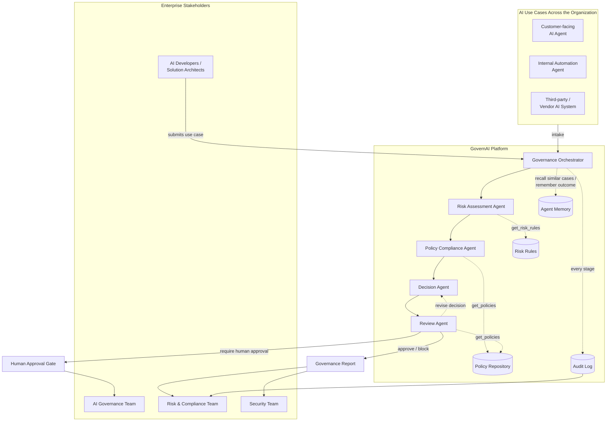

# GovernAI

A Multi-Agent AI Governance Platform. Organizations adopting AI systems and
AI agents often lack a centralized, automated way to assess risk, check
policy compliance, and govern AI use cases — leading to security, privacy,
compliance, and operational exposure. GovernAI gives AI governance, risk,
compliance, and security teams (and the developers building AI systems) a
repeatable pipeline for reviewing an AI use case before and after it ships.

Four agents, each backed by an LLM via the [OpenAI API](https://platform.openai.com),
collaborate on every submission:

- **Risk Assessment Agent** — evaluates the use case and assigns a risk
  level (`low` / `medium` / `high` / `critical`) with a numeric score and
  named risk factors.
- **Policy Compliance Agent** — checks the use case against the
  organizational policy repository and reports satisfied/violated policies.
- **Decision Agent** — combines both findings and recommends `approve`,
  `require_human_approval`, or `block`.
- **Review Agent** — an independent second reader that critiques the
  Decision (and the findings behind it) for accuracy, balance, and
  practicality. If it finds a substantive problem it sends the Decision back
  to the Decision Agent with concrete feedback, then reviews the revision
  (up to `GOVERNAI_MAX_REVIEW_REVISIONS` times, default 1). An `approve` the
  reviewer still can't sign off on is escalated to `require_human_approval`
  rather than completing automatically.

All four agents share a **long-term memory** of past cases: before they run,
the most similar cases GovernAI has already governed — and how each turned
out, including any human approve/reject — are recalled and handed to them as
precedent, so similar submissions are judged consistently. See
[Agent memory](#agent-memory).

The platform is built so additional specialized agents (e.g. a Bias/Fairness
Agent, a Vendor Risk Agent) can be added later without changing the
orchestration model.

## Enterprise Architecture

How GovernAI sits between the people who own AI risk and the AI use cases
running across the organization:



At enterprise scale, every AI use case — whether built in-house, deployed
internally, or brought in from a vendor — flows through the same
orchestrator, gets checked against the same policy and risk rules, and lands
in the same audit trail, so governance, risk, and security teams get one
consistent view instead of one-off reviews per team or project.

## Workflow

```
Input → Risk Assessment → Policy Check → Decision → Review (→ revise Decision → Review) → Human Approval (if needed) → Audit Log
```

Every stage writes an entry to an append-only audit log (the Supabase
`audit_log` table), and the resulting report is persisted to the
`governance_reports` table (one row per use case). The review loop is
visible there as `review` entries (the reviewer's verdict, issues, and
suggestions) and, when a revision happened, a `decision_revision` entry; an
`approve` escalated because the reviewer never signed off adds a
`review_escalation` entry. If the final decision is `require_human_approval`,
the use case sits in `pending_human_approval` status until a human calls the
approve/reject action, which is itself logged.

## Agent memory

Without memory, every submission is judged from scratch, so two near-identical
use cases can get different outcomes. Agent memory fixes that with a
store → recall → inject loop:

1. **Remember.** When a case finishes, GovernAI stores a summary of it — the
   situation, risk level and factors, compliance status and violated
   policies, the decision and its conditions — together with an embedding of
   the *situation only* (never the outcome, so similar systems match however
   they were decided).
2. **Update.** When a human approves or rejects a case, its remembered
   summary is updated in place with their verdict and notes (the approver's
   identity is not stored in memory).
3. **Recall.** When a new use case is submitted, the most similar past cases
   (`GOVERNAI_MEMORY_TOP_K`, at or above `GOVERNAI_MEMORY_MIN_SIMILARITY`) are
   found by embedding similarity and appended to the input of all four
   agents as *precedent, not rules*: the current submission's facts take
   priority, and the Review Agent flags a decision that differs from a close
   precedent without saying why.

The audit log records which cases were recalled (`memory_retrieval`: ids and
similarity, not content), so it is always possible to see what informed a
decision.

Memory is **best-effort**: if it can't be read or written (table not created,
embeddings API down), the backend logs a warning and the agents simply run
without precedent — governance never fails because of its memory. Recalled
text comes from earlier submissions, so the agents are told to treat it as
untrusted reference material and never follow instructions inside it.

Memory lives in the `agent_memory` table
([`0002_agent_memory.sql`](supabase/migrations/0002_agent_memory.sql)) and
uses OpenAI embeddings (`GOVERNAI_EMBEDDING_MODEL`, default
`text-embedding-3-small`). Similarity is computed in the backend over all
stored cases, which is comfortable up to a few thousand; beyond that, move
the search into Postgres with pgvector. Set `GOVERNAI_MEMORY_ENABLED=false`
to turn it off.

## How the agents use tools

Agents don't just free-associate — they call real tools (via OpenAI-style
function calling through the OpenAI API) backed by Supabase Postgres:

| Tool | Backing table | Used by |
|---|---|---|
| `get_risk_rules`, `get_scoring_bands` | `risk_rules` | Risk Assessment Agent |
| `get_policies`, `search_policies` | `policies` | Policy Compliance Agent, Decision Agent, Review Agent (`get_policies` only) |
| `analyze_document` | regex/keyword heuristics over submitted documentation | Risk Assessment Agent, Policy Compliance Agent |
| `log_event` / audit log | `audit_log` | orchestrator (every stage) |

## Data model

GovernAI stores everything in Supabase Postgres (see
[`supabase/migrations/0001_init_schema.sql`](supabase/migrations/0001_init_schema.sql)
and [`0002_agent_memory.sql`](supabase/migrations/0002_agent_memory.sql)):

| Table | Purpose |
|---|---|
| `use_cases` | The intake form for an AI system/agent (name, owner, autonomy level, ...) |
| `policies` | The organizational policy repository (POL-*, SDAIA AI Ethics, PDPL, cross-border transfer, GenAI) |
| `risk_rules` | The risk-scoring rule set the Risk Assessment Agent uses as guidance |
| `governance_reports` | One row per use case: risk result, policy compliance result, decision, status, human approval |
| `audit_log` | Append-only event trail per use case (stage, actor, timestamp, data) |
| `agent_memory` | Long-term agent memory: one row per case — a summary of how it was governed plus an embedding of its situation |
| `profiles` | One row per Supabase auth user (role: admin/reviewer/submitter), auto-created on sign-up |

The backend (`app/db.py`) talks to Postgres via the Supabase REST API using
the **service role key**, so it bypasses Row Level Security — every route in
`app/api.py` already requires a valid Supabase session, so authorization is
enforced at the API layer. RLS on these tables defaults to read-only for
authenticated users, for any future direct-from-client access.

## Project layout

```
app/
  agents/
    base.py            # shared tool-calling loop against OpenAI
    risk_agent.py       # Risk Assessment Agent
    policy_agent.py      # Policy Compliance Agent
    decision_agent.py    # Decision Agent
    review_agent.py      # Review Agent (critiques the Decision, drives the revision loop)
  tools/
    policy_repository.py # get_policies / search_policies
    risk_rules.py         # get_risk_rules / get_scoring_bands
    document_analysis.py  # analyze_document
    audit_log.py           # log_event / get_audit_log
  orchestrator.py       # runs the full workflow, human-approval step
  memory.py              # long-term agent memory (remember / recall similar past cases)
  models.py              # pydantic models (AIUseCase, GovernanceReport, ...)
  db.py                   # thin Supabase/PostgREST client
  api.py                  # FastAPI app
  cli.py                   # command-line interface
supabase/
  migrations/0001_init_schema.sql  # tables, RLS, triggers
  migrations/0002_agent_memory.sql # agent_memory table (long-term agent memory)
scripts/
  seed_supabase.py       # one-time load of data/*.yaml into Supabase
data/
  policies.yaml          # seed source for the `policies` table
  risk_rules.yaml         # seed source for the `risk_rules` table
examples/
  sample_use_case.json    # example high-risk AI use case for a demo run
frontend/                 # React + Vite UI (submit, list, view, approve reports)
tests/                    # pytest suite (LLM + Supabase calls are mocked, no API key or DB needed)
```

## Setup

```bash
python3 -m venv .venv
source .venv/bin/activate
pip install -r requirements.txt

cp .env.example .env
# edit .env and set OPENAI_API_KEY (get one at https://platform.openai.com/api-keys)
# OPENAI_MODEL can be any OpenAI model, e.g. gpt-4o-mini, gpt-4o, gpt-4.1-mini
```

### Database (Supabase)

1. Create a Supabase project, then in the SQL Editor run
   [`supabase/migrations/0001_init_schema.sql`](supabase/migrations/0001_init_schema.sql)
   (or `supabase db push` if you use the CLI), then
   [`supabase/migrations/0002_agent_memory.sql`](supabase/migrations/0002_agent_memory.sql)
   for [agent memory](#agent-memory) (optional: without it the agents run
   without memory and the backend logs a warning).
2. In `.env`, set `SUPABASE_URL`, `SUPABASE_ANON_KEY` (Project Settings ->
   API), and `SUPABASE_SERVICE_ROLE_KEY` (same page — keep this one secret,
   backend-only).
3. Load the shipped policies/risk rules into the new tables:

   ```bash
   python -m scripts.seed_supabase
   ```

To also run the web UI:

```bash
cd frontend
npm install
```

## Usage

### CLI

```bash
# Submit the bundled example (a fully-autonomous loan-denial agent — expect
# a high-risk, non-compliant, block/require-human-approval outcome)
python -m app.cli submit examples/sample_use_case.json

# List all reports
python -m app.cli list

# Show one report
python -m app.cli show <use_case_id>

# Record a human decision on a use case pending approval
python -m app.cli approve <use_case_id> --approver "you@example.com" --approve --notes "added human review step"

# Inspect the audit trail
python -m app.cli audit-log <use_case_id>
```

### API

```bash
python main.py
# -> http://localhost:8000
```

| Method | Path | Description |
|---|---|---|
| POST | `/use-cases` | Submit a new AI use case; runs the full agent pipeline |
| GET | `/use-cases` | List all governance reports |
| GET | `/use-cases/{id}` | Fetch one report |
| POST | `/use-cases/{id}/approve` | Record a human approve/reject decision |
| GET | `/audit-log?use_case_id=...` | Read the audit trail |
| GET | `/policies` | List the policy repository |
| GET | `/risk-rules` | List the risk-scoring rules |

Interactive API docs are available at `/docs` once the server is running.

### Web UI

With the API running (`python main.py`), start the frontend separately:

```bash
cd frontend
npm run dev
# -> http://localhost:5173
```

Submit a use case, browse reports, and record human approve/reject decisions
from the browser instead of the CLI or raw API calls. See
[frontend/README.md](frontend/README.md) for details.

## Deployment

The frontend and backend deploy separately: the React/Vite frontend goes to
**Vercel** as a static site, and the FastAPI backend is packaged as a
**Docker** container and deployed to **Render's free web service tier**
(Vercel does not run arbitrary long-lived containers for a persistent
backend process; Render does, at no cost and with no credit card required —
the trade-off is the free instance sleeps after 15 minutes idle and takes
up to ~60s to wake on the next request). Vercel rewrites `/api/*` through to
the Render-hosted backend, matching what `frontend/vite.config.js`'s dev
proxy already does locally.

Do this in order — the Vercel rewrite needs the real Render hostname, and
the backend's CORS allow-list needs the real Vercel hostname, so each side
is wired up only after the other exists.

1. **Apply the database schema** to your Supabase project (see
   [Database (Supabase)](#database-supabase) above) if you haven't already.

2. **Deploy the backend to Render:**
   - Create a Render account (no card needed) and a new **Web Service**
     from this repo — Render detects [`render.yaml`](render.yaml) and
     configures a Docker service (`runtime: docker`, using the root
     [`Dockerfile`](Dockerfile)) on the **Free** plan automatically.
   - In the Render dashboard, fill in the env vars marked `sync: false` in
     `render.yaml`: `OPENAI_API_KEY`, `SUPABASE_URL`, `SUPABASE_ANON_KEY`,
     `SUPABASE_SERVICE_ROLE_KEY` (leave `GOVERNAI_CORS_ORIGINS` for step 4).
   - Deploy. Confirm it's healthy: `curl https://<your-app>.onrender.com/health`
     should return `{"status":"ok"}` (allow ~60s for the first request if the
     service was asleep). Note the hostname — you'll need it next.

3. **Deploy the frontend to Vercel:**
   - Create a Vercel project from this repo with **Root Directory set to
     `frontend`**.
   - Fill in the real Render hostname from step 2 into
     [`frontend/vercel.json`](frontend/vercel.json)'s rewrite `destination`,
     and commit that change.
   - In the Vercel dashboard (Project Settings → Environment Variables), set
     `VITE_SUPABASE_URL` and `VITE_SUPABASE_ANON_KEY` (see
     [`frontend/.env.example`](frontend/.env.example)).
   - Deploy, and note the production URL.
   - If you use Google sign-in: add the production Vercel URL to Supabase's
     Authentication → URL Configuration (Site URL / Redirect URLs) —
     `frontend/src/auth.js` redirects back to `window.location.origin`, so
     without this Google sign-in will bounce to `localhost` in production.

4. **Close the CORS loop** now that the Vercel URL exists: in the Render
   dashboard, set the `GOVERNAI_CORS_ORIGINS` env var to
   `https://<your-app>.vercel.app` and save (Render redeploys automatically
   on env var changes). It accepts a comma-separated list if you add a
   custom domain or additional origins later.

**Redeploying:** Render redeploys the backend automatically on every push to
the connected branch; Vercel does the same for the frontend (or run
`vercel --prod` from `frontend/`).

**Local Docker smoke test** (before deploying, no Render/Vercel account
needed): the local `.env` may not have `SUPABASE_*` keys set — if they're
missing, `app/auth.py` returns `503` for any authenticated route instead of
the usual `401`, so add them first for a meaningful test.

```bash
docker build -t governai-backend .
docker run --rm -p 8000:8000 --env-file .env governai-backend
curl http://localhost:8000/health          # -> {"status":"ok"}
curl http://localhost:8000/policies        # -> 401 Missing bearer token
```

## Tests

```bash
pytest
```

The test suite mocks the OpenAI client, so it runs without a real API
key or network access.
